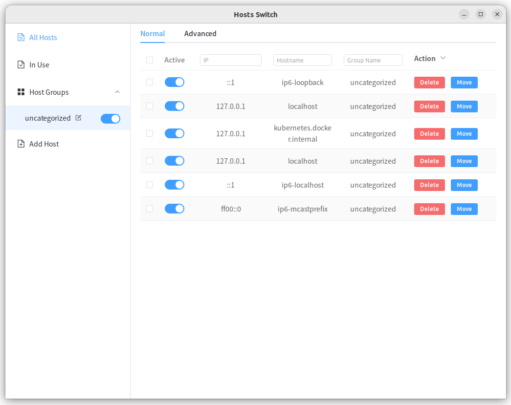
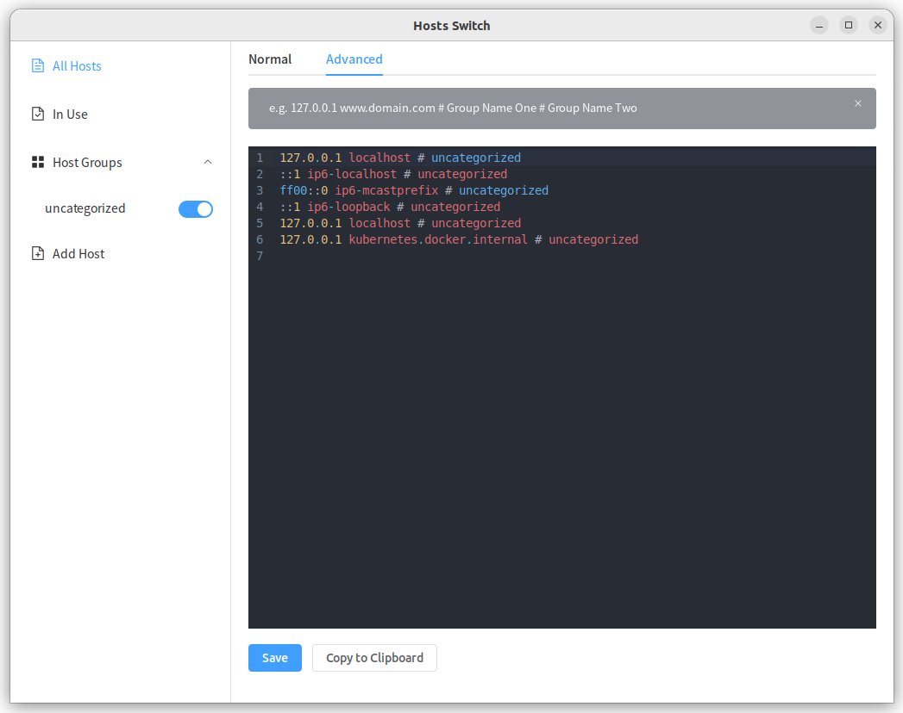

# README

## About

This is a simple desktop application developed based on [wails](https://wails.io/), compatible with Linux, Windows and Mac, which can help you better maintain your local hosts configuration.

## Screenshot

## Environmental Requirements
Based on go v1.21+, wails v2.4.0, nodejs v16. 

Wails applications built for Windows have a runtime requirement on the Microsoft WebView2 Runtime. Windows 11 will have this installed by default, but some machines won't.

## Installing Wails
Run `go install github.com/wailsapp/wails/v2/cmd/wails@latest` to install the Wails CLI.

## Live Development

To run in live development mode, run `wails dev` in the project directory. This will run a Vite development
server that will provide very fast hot reload of your frontend changes. If you want to develop in a browser
and have access to your Go methods, there is also a dev server that runs on http://localhost:34115. Connect
to this in your browser, and you can call your Go code from devtools.

## Building

To build a redistributable, production mode package, use `wails build`.

## Download

Linux: [hosts-switch-linux-amd64.deb](https://github.com/conkayyan/hosts-switch/releases/latest/download/hosts-switch-linux-amd64.deb), [hosts-switch-linux-amd64](https://github.com/conkayyan/hosts-switch/releases/latest/download/hosts-switch-linux-amd64)

Windows: [hosts-switch-windows-amd64](https://github.com/conkayyan/hosts-switch/releases/latest/download/hosts-switch-windows-amd64), [hosts-switch-amd64-installer.exe](https://github.com/conkayyan/hosts-switch/releases/latest/download/hosts-switch-amd64-installer.exe)

MacOs: [hosts-switch.pkg](https://github.com/conkayyan/hosts-switch/releases/latest/download/hosts-switch.pkg), [hosts-switch.app.zip](https://github.com/conkayyan/hosts-switch/releases/latest/download/hosts-switch.app.zip)
